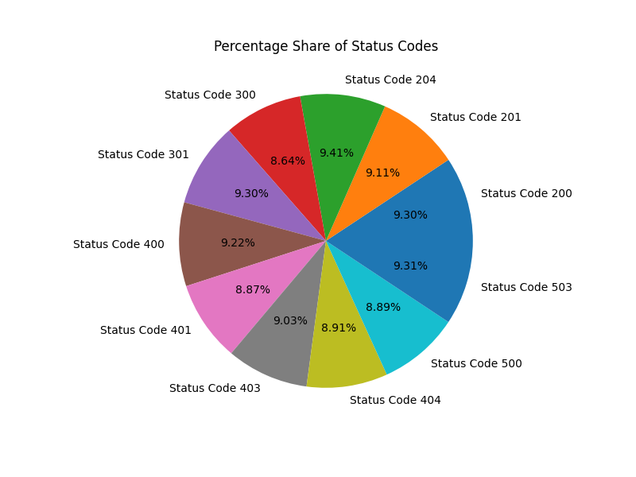

# Installation

    python3 -m venv .venv
    source .venv/bin/activate
    python -m pip install -r requirements.txt


# Usage

    python log_reader.py CSS05_Access.log

# Results
The programm will generate the following results:

`statuscode.png`



`results.yaml`

```yaml
- 200: 9.3
- 201: 9.11
- 204: 9.41
- 300: 8.64
- 301: 9.3
- 400: 9.22
- 401: 8.87
- 403: 9.03
- 404: 8.91
- 500: 8.89
- 503: 9.31
```

command line output:

```bash
Ordered list of status codes and their counts:
Status Code 200: 9.3%
Status Code 201: 9.11%
Status Code 204: 9.41%
Status Code 300: 8.64%
Status Code 301: 9.3%
Status Code 400: 9.22%
Status Code 401: 8.87%
Status Code 403: 9.03%
Status Code 404: 8.91%
Status Code 500: 8.89%
Status Code 503: 9.31%
```
